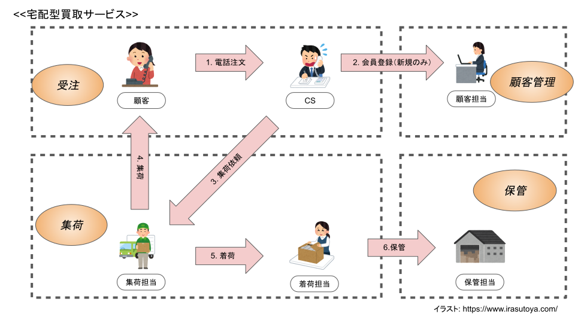

# 分析・設計

## 依頼
業務システムの開発依頼を想定しています。  
今までは紙やExcelやWordで、電話で受けた受注依頼を管理していました。  
そのため、受注業務において、受注情報が紛失、保存方式がバラバラ、統一性が保てない問題が発生しています。  
最終的には、顧客自身がWebサイト経由で注文ができるようにしたいですが、最初はCRMやERPのような業務向け支援ツールの作成を依頼したいです。  

## 業務概念図

システム化範囲は受注〜顧客管理を想定しています。  
オレンジ楕円は業務目的に該当します。

## 業務手順整理
今回のシステム化のスコープは、「受注」と「顧客管理」になります。  
ここでは、「受注〜顧客管理」のみの整理を対象とします。  

| No |  担当者 | 業務概要 | 
| --- | --- | --- |
| 1 | 顧客 | 買取の注文を依頼する |
| 2 | CS | 電話番号をを尋ねる |
| 3 | 顧客 | 電話番号を伝える |
| 4 | CS | 電話番号から会員情報を確認する |
| 5 | CS | （新規の場合）顧客情報を尋ねる |
| 6 | 顧客 | （新規の場合）顧客情報を伝える |
| 7 | CS | （新規の場合）顧客情報を登録する |
| 8 | CS | 注文内容を尋ねる |
| 9 | 顧客 | 注文内容を伝える |
| 10 | CS | 注文内容を入力する |
| 11 | CS | 注文内容を登録する |
| 12 | CS | 運送業者に集荷依頼を出す |
| 13~ | .. | 以降は集荷業務 |

## 業務分析
業務手順からアクティビティ図で業務フローの整理をします。

## 要求分析
アクティビティ図からシステム化の範囲、機能、外部関係を明確にします。  
ユースケース図とユースケースシナリオを作成します。  
ユースケースの粒度は、アクターからみて1つの完結した機能単位とします。  
ユースケースを作成したら、オブジェクトも抽出しておきます。  

## システム分析
作成したユースケースからオブジェクトを導出し、クラス構造を明らかにします。  
オブジェクトの導出については、先のユースケース図の時に一緒に実施しています。  
ここでは、導出したオブジェクトをもとに関連や多重度を決定していきます。  

## 設計
シーケンス図を作成して振る舞いを明らかにします。  
振る舞いが明らかになったら、分析クラス図に反映して設計クラス図を作ります。

