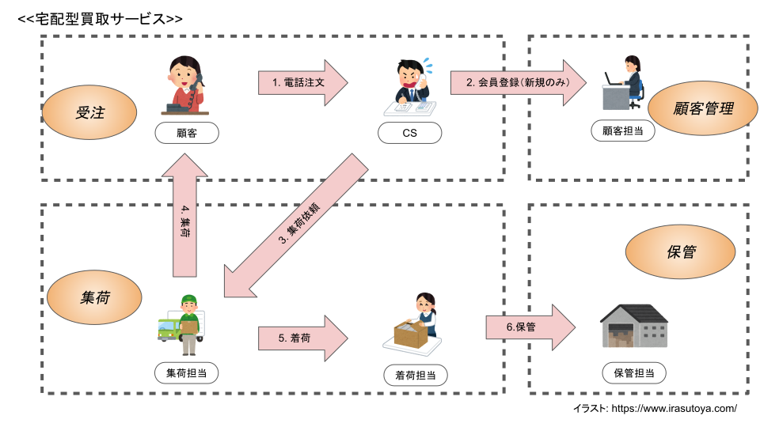

# 業務分析

## ビジネス概念図

システム化範囲は受注〜顧客管理を想定しています。  
オレンジ楕円は業務目的に該当します。

### 業務要件
利用者（会員）からの注文の入り口を電話だけではなくWebサイト経由も増やしたい。  
CS（CustomerSupport）の業務負担を軽減させたい。  

### 業務手順整理
今回のシステム化のスコープは、「受注」と「顧客管理」になります。  
ここでは、「受注〜顧客管理」のみの整理を対象とします。  

| No |  担当者 | 業務概要 | 
| --- | --- | --- |
| 1 | 顧客 | 買取の注文を依頼する |
| 2 | CS | 電話番号をを尋ねる |
| 3 | 顧客 | 電話番号を伝える |
| 4 | CS | 電話番号から会員情報を確認する |
| 5 | CS | （新規の場合）生年月日と名前を尋ねる |
| 6 | 顧客 | （新規の場合）生年月日と名前を伝える |
| 7 | CS | （新規の場合）生年月日と名前を登録する |
| 8 | CS | 注文内容を尋ねる |
| 9 | 顧客 | 注文内容を伝える |
| 10 | CS | 注文内容を登録する |
| 11 | CS | 運送業者に集荷依頼を出す |
| 12~ | .. | 以降は集荷業務 |

## アクティビティ図
業務手順からアクティビティ図で業務フローの整理をします。

